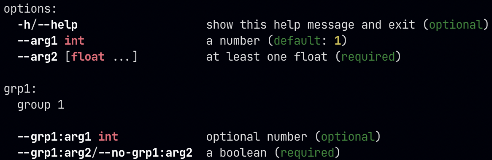

# corgy

Elegant command line parsing for Python.

Corgy allows you to create a command line interface in Python, without worrying about boilerplate code. This results in cleaner, more modular code.

```python
from corgy import Corgy, corgyparser

class ArgGroup(Corgy):
    arg1: Annotated[Optional[int], "optional number"]
    arg2: Annotated[bool, "a boolean"]

class MyArgs(Corgy):
    arg1: Annotated[int, "a number"] = 1
    arg2: Annotated[Sequence[float], "at least one float"]
    grp1: Annotated[ArgGroup, "group 1"]

args = MyArgs.parse_from_cmdline()
```

Compare this to the equivalent code which uses argparse:

```python
from argparse import ArgumentParser, BooleanOptionalAction

parser = ArgumentParser()
parser.add_argument("--arg1", type=int, help="a number", default=1)
parser.add_argument("--arg2", type=float, nargs="+", help="at least one float", required=True)

grp_parser = parser.add_argument_group("group 1")
grp_parser.add_argument("--arg3:arg1", type=int, help="optional number")
grp_parser.add_argument("--arg3:arg2", help="a boolean", action=BooleanOptionalAction)

args = parser.parse_args()
```

Corgy also provides support for more informative help messages from `argparse`, and colorized output:



# Install
**`corgy` requires Python 3.9+**. It is available on PyPI, and can be installed with pip:

```bash
pip install corgy
```

Support for colorized output requires the `crayons` package, also available on PyPI. You can pull it as a dependency for `corgy` by installing with the `colors` extra:

```bash
pip install corgy[colors]
```

# Usage
To create a command line interface, subclass `Corgy`, and declare your arguments using type annotations.

```python
class A(Corgy):
    x: int
    y: float
```

At runtime, class `A` will have `x`, and `y` as properties, so that the class can be used similar to Python dataclasses.

```python
a = A()
a.x = 1
a.y = a.x + 1.1
```

For command line parsing, `x` and `y` are added to an `ArgumentParser` object with the approriate arguments passed to `ArgumentParser.add_argument`. This is roughly equivalent to:

```python
parser = ArgumentParser()
parser.add_argument("--x", type=int, required=True)
parser.add_argument("--y", type=float, required=True)
```

`Corgy` does not support positional arguments. All arguments are converted to optional arguments, and prefixed with `--`.

## Special annotations
`Corgy` recognizes a number of special annotations, which are used to control how the argument is parsed.

### Annotated
`typing.Annotated` can be used to add a help message.

```python
x: Annotated[int, "help for x"]
```

`Annotated` can accept multiple arguments, but only the first two are used by `Corgy`. The first argument is the type, and the second is the help message. `Annotated` should always be the outermost annotation; other special annotations should be part of the type.

### Optional
`typing.Optional` can be used to mark an argument as optional.

```python
x: Optional[int]
```

Another way to mark an argument as optional is to provide a default value.

```python
x: int = 0
```

Default values can be used in conjunction with `Optional`.

```python
x: Optional[int] = 0
```

Note that the last two examples are not equivalent, since the type of `x` is `Optional[int]` in the last example, so it is allowed to be `None`.

When parsing from the command line, arguments which are not marked as optional (because they are not marked with `Optional`, and don't have a default value) will be required.

**Default values are not type checked, and can be arbitrary objects.**

### Sequence
`collections.abc.Sequence` can be used to specify that an argument accepts multiple space-separated values. `typing.Sequence` can also be used, but is not recommended as it is deprecated since Python 3.9.

There are a few different ways to use `Sequence`, each resulting in different conditions for the parser. The simplest case is a plain sequence.

```python
x: Sequence[int]
```

This represents a (possibly empty) sequence, and corresponds to the following call to `ArgumentParser.add_argument`.

```python
parser.add_argument("--x", type=int, nargs="*", required=True)
```

Note that since the argument is required, parsing an empty list will still require `--x` in the command line. After parsing, `x` will be a `list`. To denote an optional sequence, use `Optional[Sequence[...]]`.

To specify that a sequence must be non-empty, use:

```python
x: Sequence[int, ...]
```

This will result in `nargs` being set to `+` in the call to `ArgumentParser.add_argument`. Using this syntax **requires** `collections.abc.Sequence`, since `typing.Sequence` does not accept `...` as an argument.

Finally, you can specify a fixed length sequence.

```python
x: Sequence[int, int, int]
```

This amounts to `nargs=3`. All types in the sequence must be the same. So, `Sequence[int, str, int]` will result in a `TypeError`.

### Literal
`typing.Literal` can be used to specify that an argument takes one of a fixed set of values.

```python
x: Literal[0, 1, 2]
```

The provided values are passed to the `choices` argument of `ArgumentParser.add_argument`. All values must be of the same type, which will be inferred from the type of the first value.

`Literal` itself can be used as a type, for instance inside a `Sequence`.

```python
x: Sequence[Literal[0, 1, 2], Literal[0, 1, 2]]
```

This is a sequence of length 2, where each element is either 0, 1, or 2.

### Bool
`bool` types (when not in a sequence) are converted to `argparse.BooleanOptionalAction`.

```python
class A(Corgy):
    arg: bool

parser = ArgumentParser()
A.add_to_parser(parser)
parser.print_help()
```

```output
usage: -c [-h] --arg | --no-arg

optional arguments:
  -h, --help       show this help message and exit
  --arg, --no-arg
```

## Argument Groups
`Corgy` classes can themselves be used as a type, to represent a group of arguments.

```python
class A(Corgy):
    x: int
    y: float

class B(Corgy):
    x: int
    grp: Annotated[A, "a group"]
```

Group arguments are added to the command line parser with the group argument name prefixed. In the above example, parsing using `B` would result in the arguments `--x`, `--grp:x`, and `--grp:y`. `grp:x` and `grp:y` will be converted to an instance of `A`, and set as the `grp` property of `B`.

## Custom Parsers
To use a custom function for parsing an argument, use the `corgy.corgyparser` decorator.

```python
class A(Corgy):
    time: tuple[int, int, int]

    @corgyparser("time")
    def parse_time(s):
        return tuple(map(int, s.split(":")))
```

The decorated function should accept a single string, and return the parsed value.

## `Corgy` Methods
`Corgy` subclasses have the following public methods.

### *classmethod* `Corgy.add_args_to_parser(parser: argparse.ArgumentParser, name_prefix: str = "")`
Add arguments for the class to the given parser. Options:

* `parser`: The `argparse.ArgumentParser` to add arguments to.

* `name_prefix`: A prefix to add to the argument names. Arguments will be named `--<name-prefix>:<var-name>`. This is useful for grouping arguments.

### *classmethod* `Corgy.parse_from_cmdline(parser: Optional[argparse.ArgumentParser], **parser_args)`
Parse an object of the class from command line arguments. Options:

* `parser`: The `argparse.ArgumentParser` to use. If not provided or `None`, a new parser will be created.

* `parser_args`: Arguments to be passed to `argparse.ArgumentParser()`. Ignored if `parser` is not `None`.

This method will return an instance of the `Corgy` subclass, with properties set to their parsed values.

## `CorgyHelpFormatter`
`CorgyHelpFormatter` is a help formatter for `argparse`, with support for colorized output. `Corgy.parse_from_cmdline` uses this formatter by default, unless a different `formatter_class` argument is provided.

`CorgyHelpFormatter` can also be used independently of `Corgy`. Simply pass it as the `formatter_class` argument to `argparse.ArgumentParser()`:

```python
from argparse import ArgumentParser
from corgy import CorgyHelpFormatter

parser = ArgumentParser(formatter_class=CorgyHelpFormatter)
...
```

### Configuration
To configure `CorgyHelpFormatter`, you can set a number of attributes on the class. Note that you do not need to create an instance of the class; that is done by the parser itself. The following public attributes are available:

* `enable_colors`: If `None` (the default), colors are enabled if the `crayons` package is available, and the output is a tty. To explicitly enable or disable colors, set to `True` or `False`.

* `color_<choices/keywords/metavars/defaults/options>`: These attributes control the colors used for various parts of the output (see below for reference). Available colors are `red`, `green`, `yellow`, `blue`, `black`, `magenta`, `cyan`, and `white`. Specifying the name in all caps will make the color bold. You can also use the special value `BOLD` to make the output bold without changing the color. The default value are `blue` for choices, `green` for keywords, `RED` for metavars, `YELLOW` for defaults, and `BOLD` for options.

```text
    -a/--arg str       help for arg ({'a'/'b'/'c'} default: 'a')
       |      |                          |            |      |
    options  metavars                 choices      keywords defaults
```

* `output_width`: The number of columns used for the output. If `None` (the default), the current terminal width is used.

* `max_help_position`: How far to the right (from the start), the help string can start from. If `None`, there is no limit. The default is `40`.

* `marker_extras_<begin/end>`: The strings used to enclose the extra help text (choices, default values etc.). The defaults are `(` and `)`.

* `marker_choices_<begin/end>`: The strings used to enclose the list of choices for an argument. The defaults are `{` and `}`.

* `marker_choices_sep`: The string used to separate individual choices in the choice list. The default is `/`.
